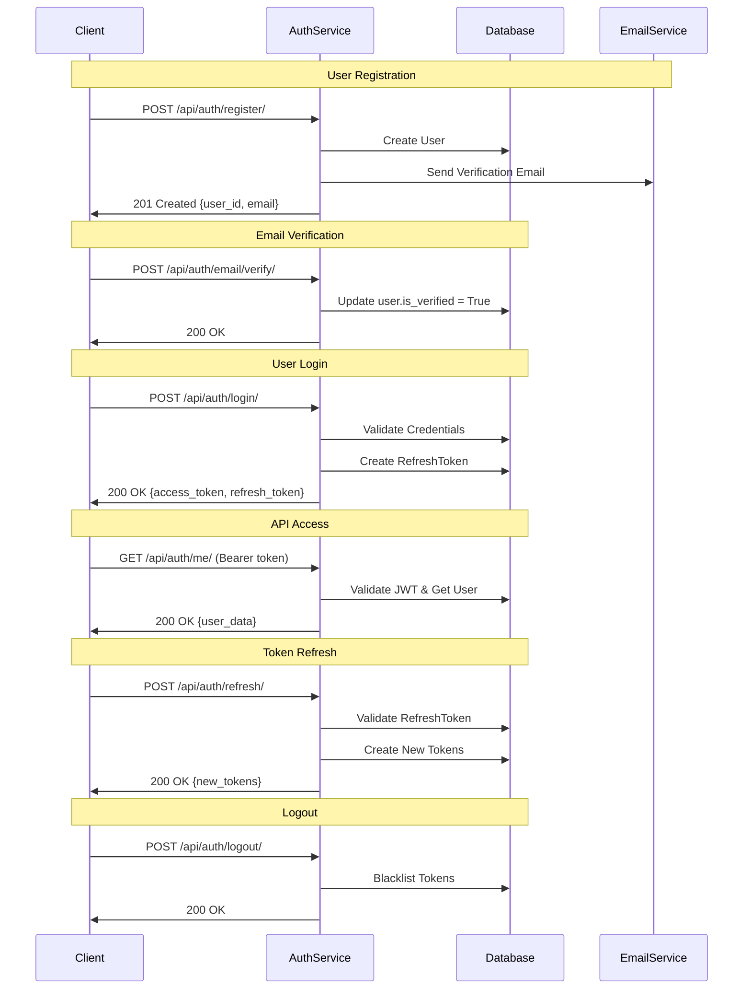
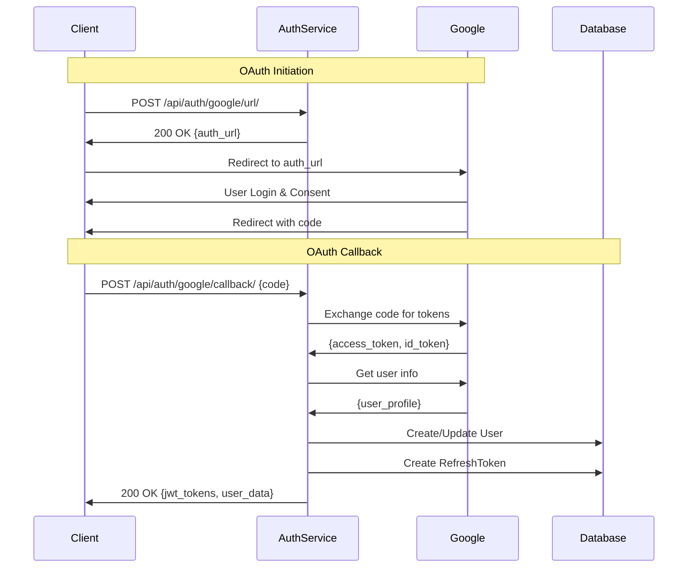

# 🔐 Authentication Pipeline & Microservice Integration Guide

## 📋 Tổng quan

Auth-service là một microservice độc lập chuyên xử lý authentication và authorization cho toàn bộ hệ thống. Service này cung cấp JWT-based authentication với khả năng tích hợp Google OAuth và hỗ trợ communication giữa các microservices.

## 🔄 Authentication Pipeline

### 1. Traditional Authentication Flow



### 2. Google OAuth Flow



## 🏗️ Kiến trúc Microservice

### Service Architecture

```
┌─────────────────┐    ┌─────────────────┐    ┌─────────────────┐
│   Frontend      │    │   API Gateway   │    │   Auth Service  │
│   (React/Vue)   │◄──►│   (Nginx/Kong)  │◄──►│   (Django)      │
└─────────────────┘    └─────────────────┘    └─────────────────┘
                                │                       │
                                │                       ▼
┌─────────────────┐    ┌─────────────────┐    ┌─────────────────┐
│   User Service  │    │  Order Service  │    │   PostgreSQL    │
│   (Node.js)     │    │   (Python)      │    │   Database      │
└─────────────────┘    └─────────────────┘    └─────────────────┘
         │                       │                       │
         └───────────────────────┼───────────────────────┘
                                 ▼
                    ┌─────────────────┐
                    │   Redis Cache   │
                    │   (Sessions)    │
                    └─────────────────┘
```

### Database Schema

```sql
-- Users Table
CREATE TABLE users (
    id UUID PRIMARY KEY DEFAULT gen_random_uuid(),
    email VARCHAR(255) UNIQUE NOT NULL,
    password VARCHAR(255),
    first_name VARCHAR(150),
    last_name VARCHAR(150),
    is_active BOOLEAN DEFAULT TRUE,
    is_verified BOOLEAN DEFAULT FALSE,
    role VARCHAR(10) DEFAULT 'user',
    jwt_key UUID DEFAULT gen_random_uuid(),
    created_at TIMESTAMP DEFAULT NOW(),
    updated_at TIMESTAMP DEFAULT NOW()
);

-- Refresh Tokens Table
CREATE TABLE refresh_tokens (
    id UUID PRIMARY KEY DEFAULT gen_random_uuid(),
    user_id UUID REFERENCES users(id) ON DELETE CASCADE,
    token TEXT NOT NULL,
    expires_at TIMESTAMP NOT NULL,
    is_blacklisted BOOLEAN DEFAULT FALSE,
    device_id VARCHAR(255),
    device_name VARCHAR(100),
    ip_address INET,
    created_at TIMESTAMP DEFAULT NOW()
);

-- Blacklisted Tokens Table
CREATE TABLE blacklisted_tokens (
    id UUID PRIMARY KEY DEFAULT gen_random_uuid(),
    user_id UUID REFERENCES users(id) ON DELETE CASCADE,
    token TEXT NOT NULL,
    expires_at TIMESTAMP NOT NULL,
    blacklisted_at TIMESTAMP DEFAULT NOW()
);
```

## 🔑 JWT Token Structure

### Access Token Payload
```json
{
  "token_type": "access",
  "exp": 1690200900,
  "iat": 1690200000,
  "jti": "unique-token-id",
  "user_id": "550e8400-e29b-41d4-a716-446655440000",
  "email": "user@example.com",
  "is_staff": false,
  "is_superuser": false
}
```

### Refresh Token Payload
```json
{
  "token_type": "refresh",
  "exp": 1690804800,
  "iat": 1690200000,
  "jti": "unique-refresh-id",
  "user_id": "550e8400-e29b-41d4-a716-446655440000",
  "email": "user@example.com"
}
```

## 🌐 Microservice Integration

### 1. Service-to-Service Authentication

**Method 1: Microservice Key (Recommended for internal services)**
```bash
# Internal service calls
curl -X GET http://auth-service:8000/api/users/550e8400-e29b-41d4-a716-446655440000/ \
  -H "X-Microservice-Key: your-microservice-secret-key"
```

**Method 2: JWT Token Validation**
```bash
# Validate user token from other services
curl -X GET http://auth-service:8000/api/auth/me/ \
  -H "Authorization: Bearer user-access-token"
```

### 2. User Service Integration

**User Service (Node.js) Example:**
```javascript
// middleware/auth.js
const axios = require('axios');

const authenticateUser = async (req, res, next) => {
  try {
    const token = req.headers.authorization?.replace('Bearer ', '');
    
    if (!token) {
      return res.status(401).json({ error: 'No token provided' });
    }
    
    // Validate token with auth-service
    const response = await axios.get('http://auth-service:8000/api/auth/me/', {
      headers: { Authorization: `Bearer ${token}` }
    });
    
    req.user = response.data;
    next();
  } catch (error) {
    if (error.response?.status === 401) {
      return res.status(401).json({ error: 'Invalid token' });
    }
    return res.status(500).json({ error: 'Authentication service error' });
  }
};

// Usage in routes
app.get('/api/profile', authenticateUser, (req, res) => {
  res.json({ user: req.user });
});
```

### 3. Order Service Integration

**Order Service (Python/FastAPI) Example:**
```python
# auth_middleware.py
import httpx
from fastapi import HTTPException, Depends
from fastapi.security import HTTPBearer

security = HTTPBearer()

async def get_current_user(token: str = Depends(security)):
    async with httpx.AsyncClient() as client:
        try:
            response = await client.get(
                "http://auth-service:8000/api/auth/me/",
                headers={"Authorization": f"Bearer {token.credentials}"}
            )
            
            if response.status_code == 401:
                raise HTTPException(status_code=401, detail="Invalid token")
            
            response.raise_for_status()
            return response.json()
            
        except httpx.RequestError:
            raise HTTPException(status_code=503, detail="Auth service unavailable")

# Usage in FastAPI routes
@app.get("/api/orders")
async def get_orders(current_user: dict = Depends(get_current_user)):
    return {"orders": [], "user": current_user}
```

### 4. API Gateway Integration

**Nginx Configuration:**
```nginx
# nginx.conf
upstream auth_service {
    server auth-service:8000;
}

upstream user_service {
    server user-service:3000;
}

server {
    listen 80;
    
    # Auth service routes
    location /api/auth/ {
        proxy_pass http://auth_service;
        proxy_set_header Host $host;
        proxy_set_header X-Real-IP $remote_addr;
    }
    
    # Protected user service routes
    location /api/users/ {
        # Validate token with auth service
        auth_request /auth;
        
        proxy_pass http://user_service;
        proxy_set_header Host $host;
        proxy_set_header X-User-ID $upstream_http_x_user_id;
    }
    
    # Internal auth validation
    location = /auth {
        internal;
        proxy_pass http://auth_service/api/auth/validate/;
        proxy_pass_request_body off;
        proxy_set_header Content-Length "";
        proxy_set_header X-Original-URI $request_uri;
    }
}
```

## 🔒 Security Best Practices

### 1. Token Security
```python
# Token validation with additional security checks
def validate_token_security(token, request):
    # 1. Check token blacklist
    if BlacklistedToken.objects.filter(token=token).exists():
        raise AuthenticationFailed('Token is blacklisted')
    
    # 2. Check user JWT key (for token invalidation)
    user = get_user_from_token(token)
    if token_jwt_key != user.jwt_key:
        raise AuthenticationFailed('Token invalidated')
    
    # 3. Rate limiting per user
    if check_rate_limit(user.id, request.META['REMOTE_ADDR']):
        raise AuthenticationFailed('Rate limit exceeded')
    
    # 4. Device fingerprinting (optional)
    if not verify_device_fingerprint(token, request):
        raise AuthenticationFailed('Device mismatch')
```

### 2. Microservice Security
```python
# Microservice authentication middleware
class MicroserviceAuthMiddleware:
    def __init__(self, get_response):
        self.get_response = get_response
    
    def __call__(self, request):
        # Check for microservice key
        microservice_key = request.META.get('HTTP_X_MICROSERVICE_KEY')
        
        if microservice_key:
            if microservice_key == settings.MICROSERVICE_SECRET_KEY:
                request.is_microservice = True
            else:
                return JsonResponse({'error': 'Invalid microservice key'}, status=401)
        
        return self.get_response(request)
```

## 📊 Monitoring & Logging

### 1. Authentication Metrics
```python
# metrics.py
from django.core.cache import cache
import time

def track_auth_metrics(event_type, user_id=None, success=True):
    timestamp = int(time.time())
    key = f"auth_metrics:{event_type}:{timestamp//60}"  # Per minute
    
    cache.set(key, cache.get(key, 0) + 1, timeout=3600)
    
    if user_id:
        user_key = f"user_auth:{user_id}:{timestamp//3600}"  # Per hour
        cache.set(user_key, cache.get(user_key, 0) + 1, timeout=86400)

# Usage in views
def login_view(request):
    try:
        # ... login logic
        track_auth_metrics('login', user.id, success=True)
    except Exception:
        track_auth_metrics('login', success=False)
```

### 2. Audit Logging
```python
# audit.py
import logging

audit_logger = logging.getLogger('auth_audit')

def log_auth_event(event_type, user_id, ip_address, user_agent, details=None):
    audit_logger.info({
        'event_type': event_type,
        'user_id': user_id,
        'ip_address': ip_address,
        'user_agent': user_agent,
        'timestamp': timezone.now().isoformat(),
        'details': details or {}
    })

# Usage
log_auth_event('login_success', user.id, request.META['REMOTE_ADDR'], 
               request.META['HTTP_USER_AGENT'])
```

## 🚀 Deployment & Scaling

### 1. Docker Compose for Development
```yaml
# docker-compose.yml
version: '3.8'
services:
  auth-service:
    build: ./auth_service
    ports:
      - "8000:8000"
    environment:
      - DB_HOST=postgres
      - REDIS_URL=redis://redis:6379/1
    depends_on:
      - postgres
      - redis
  
  user-service:
    build: ./user_service
    ports:
      - "3000:3000"
    environment:
      - AUTH_SERVICE_URL=http://auth-service:8000
  
  postgres:
    image: postgres:15
    environment:
      POSTGRES_DB: auth_service
      POSTGRES_USER: postgres
      POSTGRES_PASSWORD: postgres
  
  redis:
    image: redis:7-alpine
```

### 2. Kubernetes Deployment
```yaml
# k8s/auth-service.yaml
apiVersion: apps/v1
kind: Deployment
metadata:
  name: auth-service
spec:
  replicas: 3
  selector:
    matchLabels:
      app: auth-service
  template:
    metadata:
      labels:
        app: auth-service
    spec:
      containers:
      - name: auth-service
        image: auth-service:latest
        ports:
        - containerPort: 8000
        env:
        - name: DB_HOST
          value: "postgres-service"
        - name: REDIS_URL
          value: "redis://redis-service:6379/1"
---
apiVersion: v1
kind: Service
metadata:
  name: auth-service
spec:
  selector:
    app: auth-service
  ports:
  - port: 8000
    targetPort: 8000
```

## 🔧 Configuration Management

### Environment Variables
```bash
# Production .env
DEBUG=False
SECRET_KEY=super-secure-secret-key
JWT_SECRET_KEY=jwt-signing-key

# Database
DB_HOST=postgres.internal
DB_NAME=auth_service_prod
DB_USER=auth_user
DB_PASSWORD=secure-db-password

# Redis
REDIS_URL=redis://redis.internal:6379/1

# Google OAuth
GOOGLE_OAUTH_CLIENT_ID=your-client-id
GOOGLE_OAUTH_CLIENT_SECRET=your-client-secret

# Microservice
MICROSERVICE_SECRET_KEY=service-to-service-key
MICROSERVICE_ALLOWED_ORIGINS=http://user-service,http://order-service

# Security
CORS_ALLOWED_ORIGINS=https://yourdomain.com
SECURE_SSL_REDIRECT=True
```

## 📈 Performance Optimization

### 1. Caching Strategy
```python
# Cache user data for faster token validation
from django.core.cache import cache

def get_user_from_cache(user_id):
    cache_key = f"user:{user_id}"
    user_data = cache.get(cache_key)
    
    if not user_data:
        user = User.objects.get(id=user_id)
        user_data = {
            'id': str(user.id),
            'email': user.email,
            'is_active': user.is_active,
            'jwt_key': str(user.jwt_key)
        }
        cache.set(cache_key, user_data, timeout=300)  # 5 minutes
    
    return user_data
```

### 2. Database Optimization
```python
# Optimized queries for token validation
class OptimizedJWTAuthentication(JWTAuthentication):
    def get_user(self, validated_token):
        user_id = validated_token.payload['user_id']
        
        # Use select_related for profile data
        user = User.objects.select_related('profile').get(id=user_id)
        
        # Prefetch related tokens for blacklist check
        user = User.objects.prefetch_related(
            'blacklisted_tokens',
            'refresh_tokens'
        ).get(id=user_id)
        
        return user
```

Auth-service này được thiết kế để scale và tích hợp dễ dàng với các microservices khác trong hệ thống của bạn! 🚀
